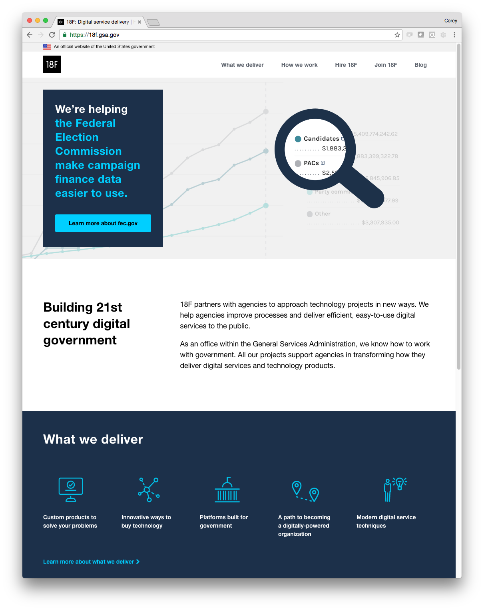

# Sprint-KuriousKettle research results

In this sprint, we focused primarily on open-ended usability testing.

See the [research plan](https://github.com/18F/18f.gsa.gov/blob/research/research/3-sprint-kuriouskettle/kuriouskettle-research-plan.md) and [interview script](https://github.com/18F/18f.gsa.gov/blob/research/research/2-sprint-festivefjord/interview-script.md) for details and methodology.

- [Participants](#participants)
- [Background](#background)
    + [Did it work to feature a different project with a different focus? (Not really)](#did-it-work-to-feature-a-different-project-with-a-different-focus)
    + [Was the revised introductory language clearer? (Yes mostly)](#was-the-revised-introductory-language-clearer)
    + [Is it effective to provide examples of how 18F worked with one agency to solve their problem? (Yes but more)](#is-it-effective-to-provide-examples-of-how-18f-worked-with-one-agency-to-solve-their-problem)
    + [What do people want to know before working with 18F? (Several things)](#what-do-people-want-to-know-before-working-with-18f)
- [Results](#results)
    + [Featuring a single project as the hero image on the homepage creates confusion.](#featuring-a-single-project-as-the-hero-image-on-the-homepage-creates-confusion)
    + [Our new introductory content is clearer, but users still have questions.](#our-new-introductory-content-is-clearer-but-users-still-have-questions)
    + [People want examples of how we've worked with other agencies.](#people-want-examples-of-how-weve-worked-with-other-agencies)
    + [The framing of the "Hire 18F" page is intimidating, and the call to action is unclear.](#the-framing-of-the-hire-18f-page-is-intimidating-and-the-call-to-action-is-unclear)
    + [Users struggled to understand what kinds of projects we take on.](#users-struggled-to-understand-what-kinds-of-projects-we-take-on)
    + [It's unclear who should contact us and what happens if they do.](#its-unclear-who-should-contact-us-and-what-happens-if-they-do)
    + [Smaller findings and notes](#smaller-findings-and-notes)
- [Recommendations](#recommendations)
    + [Create an "about" page to clarify what 18F is and our relationship to GSA.](#create-an-about-page-to-clarify-what-18f-is-and-our-relationship-to-GSA)
    + [Say who we are first, and feature several projects instead of one.](#say-who-we-are-first-and-feature-several-projects-instead-of-one)
    + [Write plain-language summaries of past projects and make them easy to find.](#write-plain-language-summaries-of-past-projects-and-make-them-easy-to-find)
    + [Clarify the call to action: invite users to contact us with inquiries.](#clarify-the-call-to-action-invite-users-to-contact-us-with-inquiries)
    + [Tell users what to expect after they contact us.](#tell-users-what-to-expect-after-they-contact-us)

## Participants

For overall usability testing, we talked to:

- 3 GSA employees from outside of TTS
- 5 federal employees from outside of GSA: Department of the Interior, Housing and Urban Development, Environmental Protection Agency, and Department of Education
- Of the 8 federal employees we talked to, about 3 of them were based outside of Washington, D.C.

## Background

Our hope in this sprint was to test the changes we made in response to the [last round of research](https://github.com/18F/18f.gsa.gov/blob/research/research/2-sprint-festivefjord/festivefjord-research-synthesis.md#recommendations).

Here's how the homepage looked during this round of research (FEC feature + new "about" content):

Key questions included:

### Did it work to feature a different project with a different focus?

+ We still featured one project (FEC)
+ The hero was more abstract, and showed our work rather than the end users of the product
+ The language in the hero area included more keywords about our work
+ We used the verb "helping" rather than "building" to focus on how we supported the agency
+ **tl;dr: No**

### Was the revised introductory language clearer?

+ We removed the mention of TTS, in hopes of simplifying how much users need to grasp right away
+ We avoided jargon as much as possible, and removed all lists
+ **tl;dr: Yes**

### Is it effective to provide examples of how 18F worked with one agency to solve their problem?

+ We began using a new "project page" template, though not all testers saw that version
+ **tl;dr: Yes**

### What do people want to know before working with 18F?

+ We haven't started changing this content yet, but we asked a number of questions about it whenever possible
+ **tl;dr: Who should contact you, and what happens?**

## Results

### Featuring a single project as the hero image on the homepage creates confusion.

People were less confused by the FEC hero image than by the prior featured project, but it still raised questions about our relationship to FEC. At least one user was interested in learning about the data angle, and several clicked to "learn more" about the project, but many users just wanted to know what **18F** is.

> I see the magnifying glass and PACs...I wonder what 18F is and who would hire them and why you would join them?

> The first thing I’m looking at is the visual on candidates and PACs...making campaign finance data easier. First thing I see because it is featured prominently on the page and because it is colorful. My first impression is that you guys are somehow tied to the FEC or it's a significant part of what you do.

> As a fed, what are you a part of? Is 18F part of FEC, or its own agency? Would you provide services to any agency that asks?

> When I come to this website, I think that 18F just makes campaign data easier to use. Until I dig deeper, I am not sure all that you do.

### Our new introductory content is clearer, but users still have questions.

Users often skipped past the new introduction paragraphs about 18F, but those who read them reacted positively. One user liked “21st century digital government,” but doesn’t know exactly what we mean by that and is curious to learn more about it.

Several users seemed confused or curious about who we are, what our name stands for, and our relationship to GSA.

> After that I went down to reading the description below...It's very straightforward, easy to read.

> One of my first thoughts is why is GSA supporting this? When I think of the GSA, I think about property ownership.

> I probably would scroll back up and click on the link under the What we deliver graphic. I guess I would be thinking, “Who are you?” as I read this. I see GSA at the bottom...I don’t know if that's an afterthought.

> Is there any significance to the name? Does that mean anything?

However, when asked to describe 18F in their own terms, many of the answers were generally in line with our own messaging:

> Smart tech people who wanted to work for the government.

> A kind of startup within a federal agency with the mission of helping its agency partners to create or improve existing technologies to better help them achieve their missions.

> What I understand is that you are kind of a for-hire consulting arm, who work in-house with other federal agencies who want to improve their technology.

> I think of it as very complementary to GSA, figuring out ways to help customers to be fearless about technology. You are the technical experts and you can help folks better use technology and make connections digitally.

### People want examples of how we've worked with other agencies.

Participants like seeing lists of past projects, but want to learn more about how we worked with the agency and what problems we solved. Some of the acronyms we use to refer to projects are obfuscatory.

> I think it's great you have examples — that's more important, to be able to envision the scope of what you've done already. That's the best way to understand what you do.

> What I think would be useful is examples of what other agencies have done IAAs with you.

> What I’m looking for is just...I assume that all these links go to an agency. What I need is [projects] broken down to the eighth-grade level: you did an IAA with Ed to compare schools...so it’s clearer what you’re providing.

> I think it would be helpful to know what kinds of work you've done. Who is your client list?

> CALC...that’s difficult for me to understand what that is.

> What I don’t see -- where do you in the partnership playbook -- where do you engage and involve the necessary resources from the agency? How do you prepare an agency for the ongoing support? 

### The framing of the "Hire 18F" page is intimidating, and the call to action is unclear.

Participants found the language about limited resources unwelcoming, and were unclear about who we wanted to hear from.

The good news is that the graphic at the top of the "Hire" page really resonated with one participant — she was able to immediately imagine her agency in the workshop, and the words on the whiteboard in the image clearly rang true.

> “Because of our limited resources" — this is a turn-off. We all have limited resources.

> It does mention you have limited resources, so it makes me think my project won’t make the cut.

> Why would I want to use 18F over other sources, like the private sector, that may have more resources? You may want to have a stronger case of why do I want to go with you. I mean the “limited resources” paragraph is the biggest in the “hire 18F” section.

> Hire 18F: Why is not the e-mail for inquiries first? Instead of the excuses of why you couldn’t work on certain projects

> Normally I look for is how to contact somebody. I don’t see an immediate...I am not looking to join. Hire doesn’t make sense to me.

> So you’re not able to help me? I have to pass a test? When I hire a contractor, they're going to jump at the work. I don’t know what the standards are in terms of picking projects in my immediate assessment. I don’t want to waste my time and go through motions if I don’t meet the criteria.

One user couldn't find the inquiries email address: "It’s all the way at the end so I missed it."

### Users struggled to understand what kinds of projects we take on.

When asked what kinds of projects they would seek help on, participants tended to quote back our own language or express confusion.

> Innovative ways to buy technology — that’s when I would say this is not for me. That might happen in the DC central office.

> That’s been tricky. We’ve thought about this. We mostly work with local gov and non profits. We are not partnered with private industry except through FHA...My understanding is that your expenses have to be covered.

> Part of the challenge is communication...our agency is fairly conservative about social media.

> Umm...you mean based on what I think you guys do right now? Honestly I’m not sure. I think I come into the technology conversation in very specific and focused ways, as in I have a need and I need technology that can address that. Mostly I need data and visualizations...[18F]seems to be more systems focused, like management consulting. It looks like more hardcore IT. If I’m not already working in that space, I wouldn’t think you guys would be the best for me.

> Interesting. You help federal agencies buy/share modern digital services. This might be something that our own IT people might be interested in...'Buy' indicated procurement.

### It's unclear who should contact us and what happens if they do.

Participants were unclear about the call to action. They wanted to know who within an agency would be empowered to contact us, and what to expect after reaching out.

> Basic: What is the process? Who can reach out to you? If I’m just an employee at [agency], could I bring a project to you guys? It seems like this would just go one OCIO to another, but I would be interested in learning more about what are the inputs. Who needs to be at the table and bought in on my end? Is there someone we could call and bounce ideas off of? Sort of a pathway to reach out to you.”

> How does the inquiry process works? What are the next steps?

> Who is your target market within the federal government? If it is CIO people, signal that. If you are looking for really interesting ideas from anywhere, you could say that.

> I want to know that I can reach a live person. I am getting sent to a general mailbox. I don’t have my expectations of what that looks like? Set some expectations of what happens. Should I be thinking about 18f in terms of my own timeline?

### Smaller findings and notes

Several users attempted to click on the "What we deliver" icons on the homepage.

The Hire and Join sections are confusingly named: "The “Hire 18F” is clever but at first makes me think of job opportunities, until I see “Join 18F” next to it."

One user clicked on 'Joining 18F,' and remarked on how we say we are offering positions, but then we are like “nevermind.”

Many participants commented either positively or negatively on how our website breaks the mold of government web design:

> This doesn't look very U.S. government

> What I like about this is that it is easy to read! Big icons, big text. No competing information. On the EPA and other federal websites, they usually try to cram too much stuff in!

Featured blog posts on the homepage help people understand the depth and breadth of our work, even if they don't understand all of the vocabulary.

One user commented: “For state and local work...I love that you were able to find a path to making that work. Not a work around. My sense is that y’all are very flexible, and you take government values seriously.”

-----

## Recommendations

### Create an "about" page to clarify what 18F is and our relationship to GSA.

Hypothesis: For users within government, we can help build trust by being direct about our organizational situation, what our name means, and how we operate.

This will also give us space to clarify our relationship with TTS without overloading the homepage.

### Say who we are first, and feature several projects instead of one.

In other words, stop featuring a single project at the top of the homepage.

Hypotheses:

- Putting a clear statement about who we are at the top of the homepage will build user trust.
- Featuring several projects later on the homepage will give people examples of our work without confusing them.

### Write plain-language summaries of past projects and make them easy to find.

Hypothesis: Seeing and reading about past projects will help people assess whether they have 18F-shaped problems, and how we might be able to help.

### Clarify the call to action: invite users to contact us with inquiries.

Hypotheses:

- Making the call to action clearer will result in more inquiries.
- Removing language about "limited resources" will result in more inquiries.
- Renaming the "Hire" page to be less similar to "Join" will help users contact us.

### Tell users what to expect after they contact us.

Hypothesis: Users are more likely to contact us if they know what to expect.

